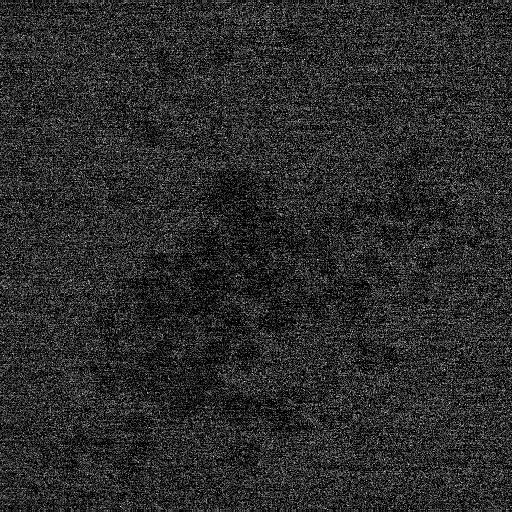
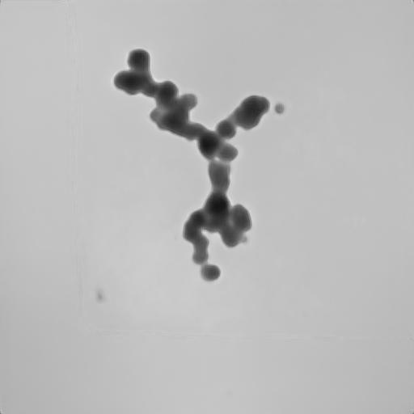

# FI-TEM_with_LDE

This is a pytorch code of Fast improvement of TEM Images with Low-Dose Electrons by Deep Learning (Microsc. Microanal. 28 (2022), pp 138--144.)

[Paper](https://doi.org/10.1017/S1431927621013799)

This code includes the default model for training and testing.

## Setup

### Requirement
Python (ver. 3) libraries: 
torch  
torchvision 
segmentation_models_pytorch 
numpy 
cv2 
skimage 

### Dataset
Sample images are located at the ./train and ./val folder.
The dataset consists of a set of three images: one bright image and two dark images.
All Dataset will be opened.

### Testing

Run "python test.py val/0001.tif".
"test.jpg" file is generated.

### dark image
This jpg image is converted from val/0001.tif for visualization.

### improved image

### Sample code for training and testing 
Jupyter notebook files for training and testing are located in the ipynb folder.

## Citation
Hiroyasu Katsuno, Yuki Kimura, Tomoya Yamazaki and Ichigaku Takigawa, Microsc. Microanal. 28 (2022) pp.138--144.

### License
MIT License.

