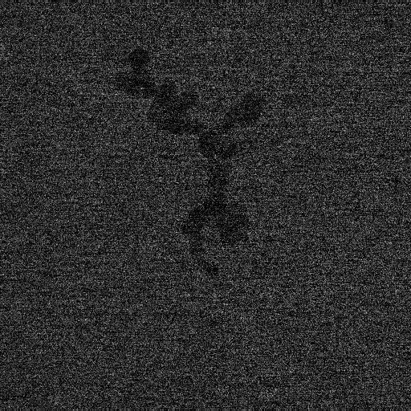

# Fast-Improvement-Low-Dose-TEMimages

This is a pytorch code of Fast improvement of TEM Images with Low-Dose Electrons by Deep Learning (Microsc. Microanal. 28 (2022), pp 138--144.)

[Paper](https://doi.org/10.1017/S1431927621013799)

This code includes the default model for training and testing.

## Setup

### Requirement
Python (ver. 3) libraries: 
torch  
torchvision 
segmentation_models_pytorch 
numpy 
cv2 
skimage 

### Dataset
Sample images are located at the ./train and ./val folder.
The dataset consists of a set of three images: one high-dose-electron (HDE) image and two low-dose-electron (LDE) images.
The file format of images are 16-bit grayscale tiff.
The resolution of HDE (LDE) image is 4096 x 4096 (512 x 512) pixels. 

All Dataset are available at [Zenodo](https://doi.org/10.5281/zenodo.7024737).

## Testing

`python test.py val/0002.tif`

### Before
This image (0002.jpg) is converted from val/0002.tif for visualization.

### after

### Sample code for training and testing 
Jupyter notebook files for training and testing are located in the ipynb folder.

## Citation
Hiroyasu Katsuno, Yuki Kimura, Tomoya Yamazaki and Ichigaku Takigawa, Microsc. Microanal. 28 (2022) pp.138--144.

### License
MIT License.

